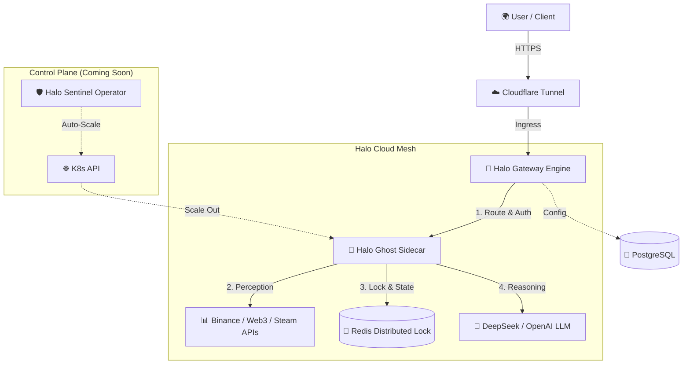

# Halo Cloud ☁️🤖

> **The First Cloud-Native AI Agent Mesh for Java & Spring Developers.**
>
> 专为 Java 开发者打造的云原生 AI Agent 编排平台。

[]()
[](LICENSE)
[](https://spring.io/projects/spring-boot)
[](https://kubernetes.io/)
[](https://spring.io/projects/spring-ai)

## 📖 Introduction

**Halo Cloud** is an open-source infrastructure designed to build, deploy, and manage AI Agents using **Java** and **Kubernetes**.

While the Python ecosystem (LangChain/Dify) dominates the AI landscape, Java developers lack a cloud-native, high-concurrency solution. Halo Cloud bridges this gap by leveraging **Spring Cloud Gateway** and the **Kubernetes Sidecar Pattern**, injecting AI capabilities into microservices without rewriting business logic.

Halo Cloud is not just a framework; it's an **Agent Mesh**.
* **The Infrastructure**: `halo-gateway-engine` handles traffic, auth, and routing.
* **The Brain**: `halo-ghost-sidecar` handles perception, reasoning, and tool execution.
* **The Orchestrator**: `halo-sentinel-operator` (Planned) manages the lifecycle and scaling of agents based on financial market volatility.

## 🏗️ Architecture



## 🌟 Key Features

* **☕ Java Native**: Built on **Spring AI** and Spring Boot 3. Seamless integration for enterprise Java teams.
* **🚀 Reactive Gateway**: High-performance AI traffic router based on **Spring WebFlux** & **R2DBC**. Handles high-concurrency prompts with non-blocking I/O.
* **🛡️ Sidecar Architecture**: Decouples AI logic (Perception/Action) from the main service. Agents run as independent processes (Sidecars).
* **🔒 Distributed Safety**: Built-in **Redisson Distributed Lock** prevents "Split-Brain" issues (duplicate execution) and saves API tokens in multi-replica K8s deployments.
* **🧠 Model Agnostic**: Supports OpenAI, DeepSeek, Claude, and Local LLMs via standard interfaces.
* **📈 Event-Driven Scaling**: (In Progress) Auto-scale agents based on market volatility events using K8s Operators.

## 🛣️ Roadmap & Status

We are building in public! Our vision is to create a SaaS-ready Financial Monitoring Platform.

### ✅ Phase 1: The Foundation (Current Status)
- [x] **Core Engine**: Reactive Gateway integrated with **DeepSeek V3 API**.
- [x] **Agent Sidecar**: Standalone process for autonomous tasks.
- [x] **Real-time Perception**: Integration with **Web3 APIs** to fetch real-time BTC price & 24h change.
- [x] **Distributed Lock**: Implemented `Redisson` lock to ensure task uniqueness across multiple pods.
- [x] **Infrastructure**: Docker Compose setup for Redis and PostgreSQL.

### 🚧 Phase 2: Intelligence & Orchestration (In Progress)
- [ ] **Dynamic Configuration**: Move API Keys from `application.yml` to PostgreSQL for hot-reloading (R2DBC).
- [ ] **Halo Sentinel Operator**: Develop a K8s Custom Resource Definition (CRD) to manage Agent deployment.
- [ ] **Auto-Scaling**: Trigger K8s HPA based on market volatility signals (e.g., if BTC drops 5%, scale up agents).
- [ ] **Notification Channels**: Integration with Email/DingTalk etc. for agent alerts.

### 🔮 Phase 3: Enterprise & SaaS (Future)
- [ ] **Plugin Market**: Support for GameFi (Steam), Luxury Goods, and Stock Market plugins.
- [ ] **RAG Integration**: Vector Database (pgvector) support for long-term memory of financial history.
- [ ] **SaaS Dashboard**: A visual UI for prompt engineering and monitoring (Multi-tenant support).

## 🚀 Quick Start

### Prerequisites
* JDK 17+
* Maven 3.8+
* Docker & Docker Compose

### 1. Start Infrastructure
Run the database and cache services:
```bash
docker-compose up -d
```

### 2. Configure Database
Connect to your local PostgreSQL (port 5432) and run the initialization SQL:

```sql
-- Create the configuration table
CREATE TABLE ai_provider_config(
    id BIGSERIAL PRIMARY KEY,
    provider_name VARCHAR(255),
    base_url VARCHAR(255),
    api_key VARCHAR(255),
    is_active BOOLEAN DEFAULT true,
    updated_at TIMESTAMP DEFAULT CURRENT_TIMESTAMP,
    model VARCHAR(255)
);

-- Insert your DeepSeek or OpenAI Key
INSERT INTO ai_provider_config (provider_name, base_url, api_key, model, is_active)
VALUES ('DeepSeek', '[https://api.deepseek.com](https://api.deepseek.com)', 'sk-your-key-here', 'deepseek-chat', true);
```

### 3. Run the System

**Terminal A: Start the Gateway (The Brain)**
```bash
mvn -pl halo-gateway-engine spring-boot:run
```

**Terminal B: Start the Sidecar (The Agent)**
```bash
mvn -pl halo-ghost-sidecar spring-boot:run
```

You will see the Sidecar automatically acquiring the Redis lock and analyzing market data!

---

## 🤝 Contributing
Contributions are welcome! Please submit Pull Requests or open Issues.

## 📄 License
Halo Cloud is Open Source software released under the Apache 2.0 license.