# Halo Cloud ☁️🤖

> **The First Cloud-Native AI Agent Mesh for Java & Spring Developers.**
>
> 专为 Java 开发者打造的云原生 AI Agent 编排平台。

[]()
[](LICENSE)
[](https://spring.io/projects/spring-boot)
[](https://kubernetes.io/)
[](https://spring.io/projects/spring-ai)

## 📖 Introduction

**Halo Cloud** is an open-source infrastructure designed to inject AI capabilities into existing Java microservices using the **Kubernetes Sidecar Pattern**.

Unlike Python-based frameworks (LangChain/Dify) that require separate deployments, Halo Cloud adopts an **"Agent-Native"** approach. It runs as a lightweight Java Sidecar container alongside your business application within the same Pod.

**Why Halo Cloud?**
* **Zero Intrusion**: Your legacy Java apps don't need to change a single line of code.
* **Pure Java Ecosystem**: No Python required. We leverage the power of the JVM for high-performance financial calculation and logic.
* **CRD-Driven Skills**: Manage AI skills (Java Beans) dynamically via Kubernetes Custom Resource Definitions (CRDs).

## 🏗️ Architecture

Halo Cloud adopts a **Service Mesh** like architecture for AI Agents.

* **Infrastructure**: `halo-gateway-engine` (The Brain) handles auth, rate-limiting, and routing to DeepSeek/OpenAI.
* **Runtime**: `halo-ghost-sidecar` (The Agent) runs inside the user's Pod, providing "Perception" and "Action" capabilities.
* **Orchestration**: `halo-sentinel-operator` injects sidecars and manages lifecycle based on K8s CRDs.

```mermaid
graph TD
    User[🌍 User / Client] -->|HTTPS| Cloudflare[☁️ Cloudflare Tunnel]
    Cloudflare -->|Ingress| Gateway[🧠 Halo Gateway Engine]
    
    subgraph "K8s Worker Node"
        subgraph "Business Pod (Your App)"
            Main["☕ User Java App\n(Main Container)"]
            Sidecar["👻 Halo Ghost Sidecar\n(Agent Container)"]
            
            Main <-->|Localhost / Shared Vol| Sidecar
        end
    end
    
    subgraph "Halo Cloud Mesh"
        Gateway -->|1. Route & Auth| Sidecar
        Sidecar -->|2. Perception| ExternalAPI["📊 Binance / Web3 / Steam APIs"]
        Sidecar -->|3. Reasoning| DeepSeek["🤖 DeepSeek / OpenAI LLM"]
        Sidecar -.->|4. Load Skills| CRD["📄 K8s CRD: AgentSkill"]
    end

    Gateway -.->|Config| Postgres[("🐘 PostgreSQL")]
```



## 🌟 Key Features

* **☕ Pure Java Native**: Built on **Spring AI** and Spring Boot 3. No Python dependencies. Fully compatible with enterprise Java tech stacks.
* **🛡️ Sidecar Architecture**: Decouples AI logic from business logic. The AI Agent runs as a sidecar process, monitoring and assisting the main application via `localhost`.
* **🧩 CRD-Based Skills**: Define capabilities (e.g., `MarketWatcher`, `AlertSender`) as Kubernetes CRDs. The Operator dynamically activates the corresponding Java Beans in the Sidecar.
* **🚀 Reactive Gateway**: High-performance AI traffic router based on **Spring WebFlux** & **R2DBC**.
* **🔒 Distributed Safety**: Built-in **Redisson Distributed Lock** prevents "Split-Brain" issues in multi-replica deployments.

## 🛣️ Roadmap & Status

We are building in public! Our vision is to create a standard for Java AI Agent Orchestration.

### ✅ Phase 1: The Foundation (Current Status)
- [x] **Core Engine**: Reactive Gateway integrated with **DeepSeek V3 API**.
- [x] **Agent Sidecar**: Standalone process for autonomous tasks (Standalone Mode).
- [x] **Real-time Perception**: Integration with **Web3 APIs** to fetch real-time BTC price.
- [x] **Distributed Lock**: Implemented `Redisson` lock for task uniqueness.
- [x] **Infrastructure**: Docker Compose setup for Redis and PostgreSQL.

### 🚧 Phase 2: Operator & Cloud Native (In Progress)
- [ ] **Halo Sentinel Operator**: Develop K8s Operator (Java SDK) to auto-inject `halo-ghost-sidecar` into target Deployments.
- [ ] **CRD Skill Management**: Implement `AgentSkill` CRD to dynamically load/unload Java functions (`@Tool`) without restarting the pod.
- [ ] **Dynamic Configuration**: Move API Keys to PostgreSQL with R2DBC for hot-reloading.
- [ ] **Auto-Scaling**: Trigger K8s HPA based on financial market volatility events.

### 🔮 Phase 3: Ecosystem & SaaS (Future)
- [ ] **Plugin Market**: Community-driven skills for GameFi (Steam), Luxury Goods, and Stock Market.
- [ ] **RAG Integration**: Vector Database (pgvector) support for long-term financial memory.
- [ ] **SaaS Dashboard**: A visual UI for managing Agents and Skills (Multi-tenant).

## 🚀 Quick Start (Standalone Mode)

*Note: Currently, we support "Standalone Mode" for development. The K8s Operator mode is under development.*

### Prerequisites
* JDK 17+
* Maven 3.8+
* Docker & Docker Compose

### 1. Start Infrastructure
Run the database and cache services:
```bash
docker-compose up -d
```

### 2. Configure Database
Connect to your local PostgreSQL (port 5432) and run the initialization SQL:

```sql
-- Create the configuration table
CREATE TABLE ai_provider_config(
    id BIGSERIAL PRIMARY KEY,
    provider_name VARCHAR(255),
    base_url VARCHAR(255),
    api_key VARCHAR(255),
    is_active BOOLEAN DEFAULT true,
    updated_at TIMESTAMP DEFAULT CURRENT_TIMESTAMP,
    model VARCHAR(255)
);

-- Insert your DeepSeek or OpenAI Key
INSERT INTO ai_provider_config (provider_name, base_url, api_key, model, is_active)
VALUES ('DeepSeek', 'https://api.deepseek.com', 'sk-your-key-here', 'deepseek-chat', true);
```

### 3. Run the System

**Terminal A: Start the Gateway (The Brain)**
```bash
mvn -pl halo-gateway-engine spring-boot:run
```

**Terminal B: Start the Sidecar (The Agent)**
```bash
mvn -pl halo-ghost-sidecar spring-boot:run
```

You will see the Sidecar automatically acquiring the Redis lock and analyzing market data!

---

## 🤝 Contributing
Contributions are welcome! Please submit Pull Requests or open Issues.

## 📄 License
Halo Cloud is Open Source software released under the Apache 2.0 license.